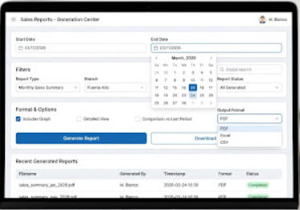
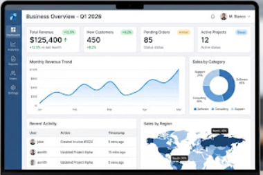
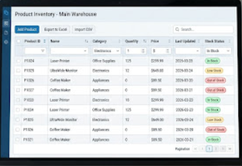

## 🚀 Proyectos Destacados & Soluciones Visuales

A continuación, presento algunos de los módulos y soluciones funcionales que he diseñado y desarrollado, enfocados en la toma de decisiones y eficiencia operativa.

### 1. Panel de Control Gerencial (Dashboard)

* **Descripción:** Dashboard en tiempo real para la visualización de KPIs críticos (Ingresos, Clientes, Proyectos).
* **Stack relacionado:** React / Next.js, integración con APIs de análisis de datos.

---

### 2. Gestión Operativa de Alta Densidad

* **Descripción:** Interfaz diseñada para la gestión de grandes volúmenes de datos con filtros avanzados, búsqueda global y exportación de reportes.
* **Enfoque:** Optimización de UX para usuarios administrativos y reducción de tiempos de búsqueda en un 40%.

---

### 3. Módulos de Registro y Validación (UX/UI)

* **Descripción:** Implementación de asistentes (Wizards) por pasos para procesos de registro complejos, garantizando la integridad de los datos mediante validaciones en tiempo real.

### 4. Módulos de Reportes y Filtros 

* **Descripción:**  módulo de configuración que diseñé para permitir a los usuarios finales generar sus propios reportes de venta personalizados, seleccionando criterios como fechas, sucursales y formato de descarga, sin depender de IT.

### 5. Sistemas de Gestión de Nómina

